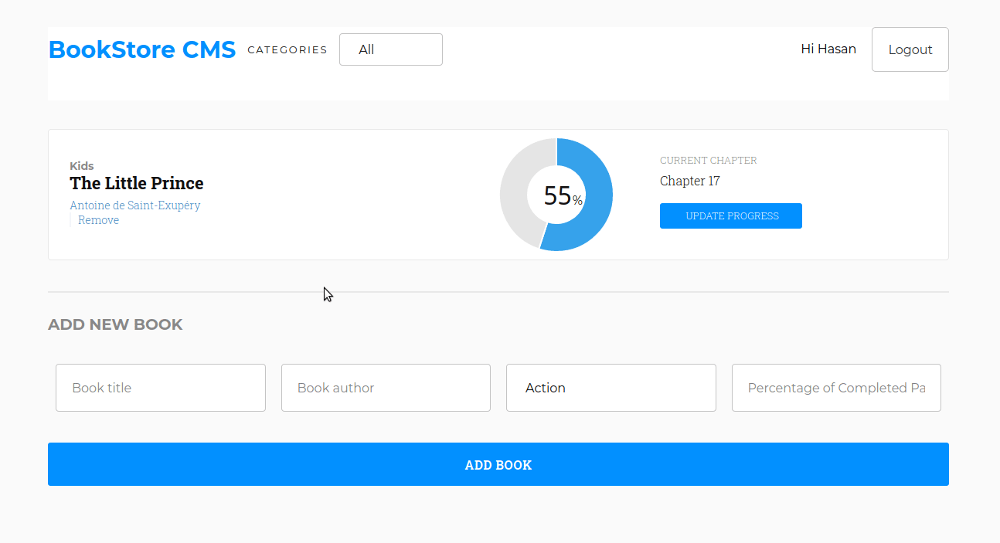

# Book Store CMS App 

This project was bootstrapped with [Create React App](https://github.com/facebook/create-react-app).
We developed a bookstore application for a fictional company using Redux and React where users can track their reading progress from the bookstore. The project includes the basic features of

- Signing in, signing up, and signing out
- Listing all books of any user
- Adding book to the bookstore
- Removing books from the bookstore
- Updating complete percentage of any book



## Live Demo

Please check [live demo.](https://bookstore.ozovalihasan.com/)

## Getting Started

To get a local copy up and running follow these simple example steps.

### Prerequisites

Make sure Node.js is running on your local machine.

### Setup

~~~bash
$ git clone https://github.com/ozovalihasan/bookstore.git
$ cd bookstore
~~~

Install modules:

```
npm install
```

### Usage

Start server with:

```
    npm start or npm start
```

### Deployment instructions

```
    git add .
    git commit -m "ready for first push to heroku"  
    heroku create $APP-NAME --buildpack mars/create-react-app
    git push heroku $BRANCH_NAME:master
```

Fire up your app by running `heroku open` Yay!!! your app has been deployed successfully.

# Authors

👤 **Uduak Essien**

- Github: [@acushlakoncept](https://github.com/acushlakoncept/)
- Twitter: [@acushlakoncept](https://twitter.com/acushlakoncept)
- Linkedin: [acushlakoncept](https://www.linkedin.com/in/acushlakoncept/)

👤 **Hasan Özovalı**

- Website: [ozovalihasan.com](https://www.ozovalihasan.com/)
- LinkedIn: [Hasan Ozovali](https://www.linkedin.com/in/hasan-ozovali/)
- Github: [@ozovalihasan](https://github.com/ozovalihasan)
- Twitter: [@ozovalihasan](https://twitter.com/ozovalihasan)
- Mail: [ozovalihasan@gmail.com](ozovalihasan@gmail.com)

## 🤝 Contributing

Contributions, issues and feature requests are welcome!

Feel free to check the [issues page](issues/).

## Show your support

Give a ⭐️ if you like this project!

## Acknowledgments
- [Microverse Inc](https://www.microverse.org/)